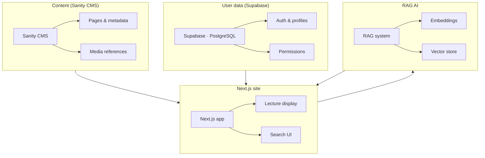
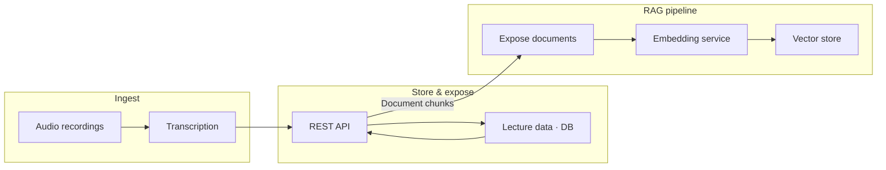

export const company = "Yeshiva University";
export const role = "Software Engineering Intern";
export const dates = "June 2025 - Present";
export const image = "/images/experience/yu.png";
export const overview =
  "Developed The Rav Project, an online learning platform, with TypeScript, Next.js, Supabase, Sanity CMS, and a custom RAG AI system. Built APIs, optimized SQL, and implemented CI/CD.";
export const companyUrl = "https://theravlegacy.org";

## Overview

The Rav Project is an online learning platform so you can search and browse lecture content. We use TypeScript and Next.js on the front end, Supabase for user and lecture data, Sanity CMS for site content, and a custom RAG (Retrieval-Augmented Generation) AI for semantic search over the lectures. As an intern I worked across the stack. I built a REST API for the RAG pipeline, wrote and optimized SQL for security and user management, built a TypeScript client for Sanity, and set up CI/CD on Vercel.

## System Architecture

The platform has four main pieces: **content** in Sanity CMS, **user data** in Supabase, **the site** in Next.js (lectures and UI), and **smart search** via the RAG AI over embedded lecture text.

- **Sanity CMS.** Holds the editorial content (pages, navigation, media). I built a TypeScript client so the backend can read and write this content.
- **Supabase.** User accounts, profiles, and permissions. We use SQL with row-level security and user management.
- **Next.js site.** It pulls content from Sanity and user data from Supabase, renders the lectures and search UI, and talks to the RAG system when you run a query.
- **RAG AI.** It takes lecture text from the pipeline below, turns it into embeddings, and stores them in a vector store so we can do semantic search.

## Lecture Data Pipeline

Lecture material goes from **audio** to **transcription** to **storage** to **RAG embedding** so you can search it by meaning.

- **Audio and transcription.** Lectures get transcribed (speech-to-text). That text feeds the rest of the pipeline.
- **Store and expose.** Transcribed content lives in the platform DB. A **REST API** I built exposes that lecture data as document chunks for the RAG pipeline.
- **RAG embedding.** The pipeline takes that data, chunks it, runs it through an embedding model, and writes vectors to the store. Smart search runs over that store.

## Key Contributions

- **REST API for RAG.** I built an API that exposes lecture data (transcripts and metadata) for the embedding pipeline. It serves document chunks in the format the RAG system needs so we can feed it without tying it to the main app.
- **SQL and security on Supabase.** I wrote and optimized SQL for row-level security and user management. The queries are set up for safe, scoped access and good performance.
- **Sanity client in TypeScript.** I built a backend client for content management so the Next.js app can read and write structured content (pages, media, metadata) and stay in sync with the CMS.
- **CI/CD on Vercel.** I set up a pipeline to automate build, test, and deploy so merges to main get deployed as previews or production.
- **Process.** I used Jira for tasks and GitHub for issues and code review. I worked with the team and project manager on planning and estimation.
