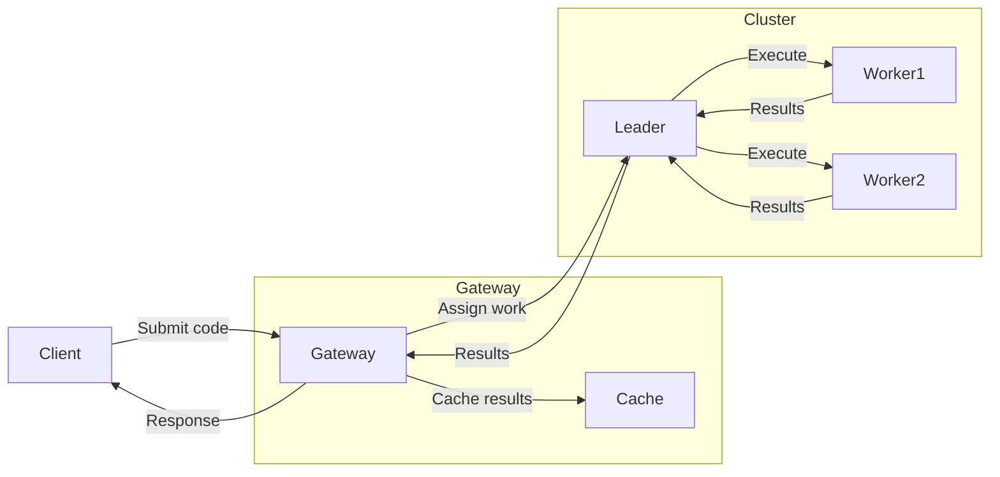
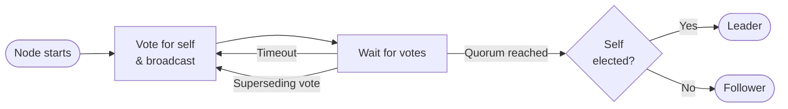

export const name = "AWS Lambda Mock";
export const image = "/images/projects/lambda.png";
export const overview =
  "A distributed system that mocks serverless code execution architecture of AWS Lambda.";
export const topics = [
  "Java",
  "Distributed Systems",
  "Serverless",
  "ZooKeeper",
  "Maven",
];
export const repoUrl = "https://github.com/MaxFdev/AWS-Lambda-Mock";

## Overview

AWS-Lambda-Mock is a distributed system built to mock the serverless code execution of AWS Lambda.
The project was developed in Java. The leader election algorithm is based on Apache ZooKeeper,
and nodes communicate with a custom gossip-style heartbeat for failure detection. Instead of a single-node test harness,
it runs as a cluster: a user-facing gateway node and multiple peer server nodes that elect a leader and execute code on workers.
The system handles node failure by reassigning work for worker failure or starting a new elections for leader failure so that
the cluster remains highly available.

## Architecture

The system has two kinds of nodes:

- **Gateway node**: Handles the user-facing API. It accepts requests to run code, caches requests when useful, and returns results to the client.
  It does not run code itself, it delegates to the peer cluster.
- **Peer server nodes**: Form the backend. They use a ZooKeeper-based leader election: one node becomes the leader, the rest are workers.
  - **The leader** talks to the gateway, receives work assignments, and distributes code-execution tasks to workers.
  - **Workers** run the code and send results back to the leader, which relays them to the gateway.

Failure detection is done with a gossip-style heartbeat: nodes exchange heartbeats and detect when a peer has failed. If the leader fails,
the remaining nodes run a new election. If a worker fails, the leader reassigns its work so the client still gets a response.

## Leader Election

The election algorithm is a simplified version of ZooKeeper's [Leader Election](https://github.com/apache/zookeeper/blob/90f8d835e065ea12dddd8ed9ca20872a4412c78a/zookeeper-server/src/main/java/org/apache/zookeeper/server/quorum/FastLeaderElection.java#L913).
Each peer node starts by voting for itself, pairing its current epoch with its server ID. Votes are ranked first by epoch, then by server ID.
So a node always adopts a vote it receives that outranks its own, then re-broadcasts.
This continues until a quorum (majority) agrees on the same candidate.
Before committing, the winner waits a short `finalizeWait` period to catch any last higher-ranked votes.
Once the election ends, the winner becomes the leader and all others become followers.

The gateway joins the peer UDP network as an **observer**. a node with `ServerState.OBSERVER`.
It never casts a vote, and other nodes discard any message it sends during an election.
By passively receiving election and gossip messages, the gateway always knows who the current leader is without any polling.
When the leader changes, it closes its active connections and routes the next request to the new leader.

## Key Components

- **Gateway**: API entry point, request caching, and coordination with the leader. No code execution.
- **Leader (elected)**: Receives work from the gateway, partitions it across workers, aggregates results, and sends them back to the gateway.
  Reassigns work when a worker fails.
- **Workers**: Execute the submitted code and return results to the leader.

## Failure Handling

- **Gossip heartbeat**: Every node participates in heartbeat exchange to detect failures.
- **Leader failure**: Detected via gossip, remaining nodes run a new leader election. The new leader takes over communication with the gateway.
- **Worker failure**: The leader detects the failure and reassigns the failed worker's tasks to other workers so the client still receives results.
- **Gateway failure**: Client-facing, typically handled by running multiple gateways or external load balancing (depending on deployment).

## Build and Run

The project is Java-based (Maven). Start the gateway and then the peer nodes, they form the cluster and begin processing code.
See the repo README and `demo5.sh` for running a full demo.
