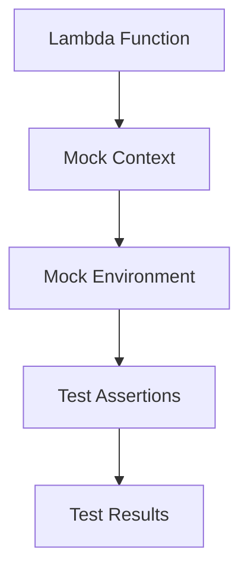

export const name = "AWS Lambda Mock";
export const image = "/images/projects/lambda.png";
export const overview = "A lightweight Java testing framework for AWS Lambda functions";
export const topics = ["Java", "AWS Lambda", "Testing", "Maven"];
export const repoUrl = "https://github.com/MaxFdev";

## Overview

AWS Lambda Mock is a comprehensive testing framework designed to simplify unit and integration testing of AWS Lambda functions written in Java. It provides a mock environment that simulates the Lambda runtime without requiring actual AWS infrastructure.

## Key Features

- **Zero AWS Dependencies**: Test Lambda functions locally without AWS credentials
- **Complete Runtime Simulation**: Mimics Lambda context, environment variables, and execution patterns
- **Easy Integration**: Works seamlessly with JUnit and other Java testing frameworks
- **Maven Support**: Simple Maven dependency integration

## Architecture

The framework follows a modular design that separates concerns:



## Usage Example

```java
@Test
public void testLambdaFunction() {
    MockLambdaContext context = new MockLambdaContext();
    MyLambdaHandler handler = new MyLambdaHandler();
    
    String result = handler.handleRequest("test input", context);
    
    assertEquals("expected output", result);
}
```

## Benefits

- **Faster Development**: No need to deploy to AWS for every test
- **Cost Effective**: Eliminate AWS costs during development
- **Reliable Testing**: Consistent test environment across all developers
- **CI/CD Friendly**: Easy integration into continuous integration pipelines

## Getting Started

Add the dependency to your `pom.xml`:

```xml
<dependency>
    <groupId>com.maxfdev</groupId>
    <artifactId>aws-lambda-mock</artifactId>
    <version>1.0.0</version>
    <scope>test</scope>
</dependency>
```

Then create your tests using the provided mock context and assertions.
