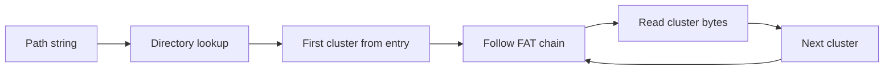

export const name = "FAT32 Reader";
export const image = "/images/projects/fat32.png";
export const overview = "Java program that reads a FAT32 disk image: a small shell to list directories, navigate, and read file content from a raw FAT32 volume.";
export const topics = ["Java", "File Systems", "FAT32", "Systems Programming"];
export const repoUrl = "https://github.com/MaxFdev/fat32_reader";

## Overview

FAT32 Reader is a Java program that navigates a FAT32 file system stored in a single file (e.g. a `.img` file). It acts as a small shell: you point it at a FAT32 image and use built-in commands to list directories, change directory, and read file contents. The implementation parses the FAT32 layout directly—boot sector, FAT tables, root directory, and data clusters—without using the OS’s file system APIs.

## FAT32 Layout

A FAT32 volume is laid out in this order on disk:


- **Boot sector**: Contains key parameters: bytes per sector, sectors per cluster, number of FATs, size of one FAT in sectors, and the cluster number of the root directory (FAT32 puts root in the data area, not a fixed sector).
- **FAT 1 & 2**: The File Allocation Table. Each entry corresponds to a data cluster; the value gives the next cluster in the chain (or end-of-chain / bad-cluster markers). FAT2 is a mirror for redundancy.
- **Root directory**: Like any directory, it’s a list of 32-byte directory entries. In FAT32, the root can grow and lives at the cluster indicated in the boot sector.
- **Data clusters**: File and directory content. Files are stored as linked lists of clusters; you follow the chain in the FAT to read the whole file.

## Reading a File

To read a file, the program (1) finds its directory entry in the current (or resolved) directory, (2) gets the first cluster number from that entry, (3) follows the FAT chain until end-of-chain, reading each cluster’s bytes:



Directory entries also store size, attributes (file vs directory, hidden, etc.), and for long file names (LFN), multiple 32-byte entries are used to build the name; the implementation must parse both short 8.3 names and LFN sequences.

## Shell Commands

The program provides a minimal shell over the opened image:

- **`info`**: Prints file system information derived from the boot sector (e.g. sector size, cluster size, FAT layout).
- **`ls`**: Lists the current directory (like `ls -a`), including `.` and `..`, in alphabetical order.
- **`stat` &lt;file|dir&gt;**: Prints size, attributes, and next cluster for the given file or directory in the current directory.
- **`size` &lt;file&gt;**: Prints the size in bytes of the given file (errors if it’s a directory or missing).
- **`cd` &lt;dir&gt;**: Changes the current directory; updates the notion of “current” for subsequent commands.
- **`read` &lt;file&gt; &lt;offset&gt; &lt;bytes&gt;**: Reads the file from `offset` for `bytes` bytes and prints the result as ASCII (or `0xNN` for non-printable bytes). Validates that the path is a file and that offset/bytes are valid.

All of these are implemented by walking directories, resolving paths, following cluster chains in the FAT, and reading the correct sectors from the image.

## Technical Details

- **Boot sector parsing**: Reading little-endian fields (bytes per sector, sectors per cluster, reserved sectors, number of FATs, sectors per FAT, root cluster, etc.) to compute the locations of FAT and root.
- **FAT traversal**: Indexing into the FAT by cluster number and following the chain until a terminal value (e.g. `0x0FFFFFF8`–`0x0FFFFFFF` for end of file).
- **Directory entries**: Parsing 32-byte entries (short name, attributes, first cluster high/low, file size) and combining LFN entries when present to get the full name.
- **Cluster chain**: Converting cluster numbers to logical sector offsets using the layout parameters, then reading those sectors from the image file.

## Build and Run

```bash
javac fat32_reader.java
java fat32_reader fat32.img
```

Then use the commands above. The repo includes scripts such as `run.sh` and `test.sh` for running and testing against the included image.
