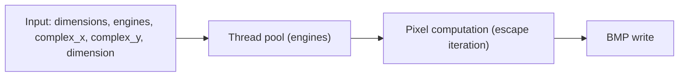

export const name = "Mandelbrot Set Generator";
export const image = "/images/projects/mandelbrot.png";
export const overview = "C-based multithreaded program that generates BMP images of the Mandelbrot set from the command line.";
export const topics = ["C", "Multithreading", "Complex Numbers", "Graphics"];
export const repoUrl = "https://github.com/MaxFdev/mandelbrot";

## Overview

This project is a multithreaded C program that renders the Mandelbrot set and writes the result as a BMP image. You specify image dimensions, the number of worker threads (“engines”), and a rectangular region in the complex plane (top-left coordinates and side length). The program divides the work among threads and outputs a BMP file (e.g. `mandeloutput_overview.bmp`, `mandeloutput_zoomed.bmp`).

## Pipeline



- **Input parameters**: Image width/height in pixels, number of engine threads, and the region in the complex plane: (complex_x, complex_y) is the top-left corner, and dimension is the width (and height) of the square in the complex plane.
- **Thread pool**: A set of “engine” threads. Work (e.g. rows or blocks of the image) is distributed so each thread computes a subset of the pixels.
- **Pixel computation**: For each pixel, the corresponding complex number c is derived from the plane region. The escape-time algorithm iterates z ← z² + c until |z| exceeds a bound or a max iteration count; the iteration count (or a function of it) determines the pixel color.
- **BMP write**: The resulting grid of pixel values is written to a BMP file so you can view it in any image viewer.

## Complex Plane and Pixels

The image is a grid of pixels. Each pixel (i, j) maps to a complex number c in the rectangle defined by (complex_x, complex_y) and the given dimension:

- The horizontal axis of the image corresponds to the real part of c; the vertical axis to the imaginary part.
- Linear interpolation maps pixel coordinates to real and imaginary values within that rectangle. So a larger dimension gives a wider view (zoomed out); a smaller dimension zooms in.

The **Mandelbrot set** is the set of c for which the iteration z₀ = 0, zₙ₊₁ = zₙ² + c stays bounded. In practice, we cap iterations; pixels that “escape” (|z| > 2) within the limit are colored by how quickly they escaped; pixels that never escape are typically colored as inside the set.

## Multithreading

Multiple “engine” threads run in parallel. The image is partitioned (e.g. by rows or tiles), and each thread computes the escape iterations for its assigned pixels. This reduces total runtime on multi-core machines. Synchronization is used only where needed (e.g. assigning work or writing the final BMP), so most of the time threads are doing independent arithmetic.

## Example Invocations

From the README:

- **Overview** (full set in view):  
  `./mandelbrot 500 10 -2.7 -2.0 4.0`  
  Image 500×500, 10 threads, top-left (-2.7, -2.0), side length 4.0 in the complex plane.

- **Zoomed** (small region):  
  `./mandelbrot 500 10 -0.749602903 -0.132456468 0.010477299`  
  Same resolution and thread count, but a small window for fine detail.

Output files (e.g. `mandeloutput_overview.bmp`, `mandeloutput_zoomed.bmp`) are produced in the current directory.

## Build and Run

```bash
gcc -pthread -Wall -Wextra -Wpedantic -o mandelbrot mandelbrot.c
./mandelbrot [image_dimensions] [engines] [complex_x] [complex_y] [mandelbrot_dimension]
```

- **image_dimensions**: Width and height of the image in pixels (e.g. 500).
- **engines**: Number of worker threads.
- **complex_x**, **complex_y**: Top-left corner of the view in the complex plane.
- **mandelbrot_dimension**: Side length of the view (same for width and height in the complex plane).
