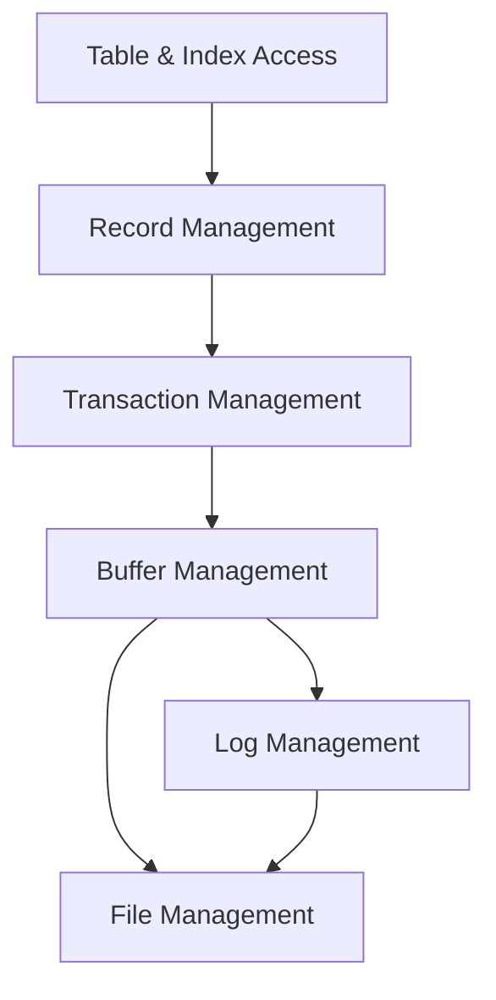
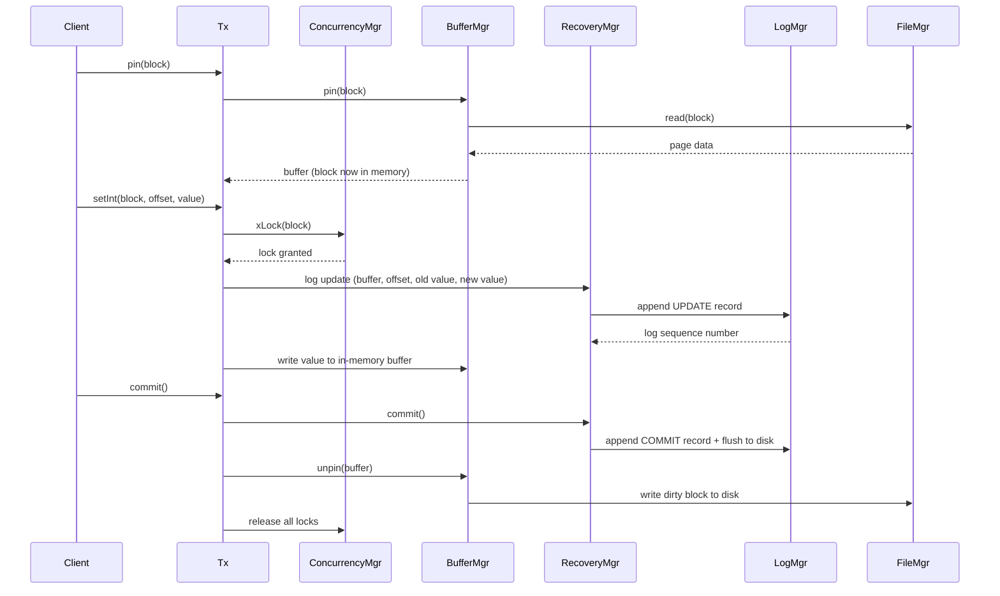

export const name = "PetiteDB";
export const image = "/images/projects/database.png";
export const overview =
  "Lightweight relational DBMS implementing standard layers: file, log, buffer, transaction, record, metadata catalog, and static hash indexes.";
export const topics = ["Java", "DBMS", "ACID", "Relational DB", "Maven"];
export const repoUrl = "https://github.com/MaxFdev/PetiteDB";

## Overview

PetiteDB is a simplified relational database management system built for COM 3563 (Database Implementation).
It is written in Java using Maven, with JUnit Jupiter for testing and Log4j for logging.
The project covers the full stack from raw disk storage up to tables and indexes, including file management,
write-ahead logging, buffer pooling, transactions, record layout, a system catalog, and indexing.
All data access is routed through transactions, the buffer manager keeps recently used data in memory to reduce disk reads,
and the log layer ensures the database can recover to a consistent state after a crash.

## Layered Architecture

The system is organized into discrete layers, each building on the one below it.

- **File**: The lowest layer treats storage as a sequence of fixed-size blocks. It handles all reading and writing to disk,
  one block at a time.
- **Log**: Before any change is written to the database, a record of that change is appended to a sequential log file.
  This is known as write-ahead logging (WAL), and it is what allows the database to recover correctly after an unexpected shutdown.
- **Buffer**: Rather than reading from disk on every operation, the buffer layer maintains a pool of in-memory pages.
  When all pages are in use and a new block is needed, the manager selects a page to evict using a policy such as CLOCK.
- **Transaction**: This layer provides ACID guarantees, meaning that each operation is atomic, consistent, isolated,
  and durable. A concurrency manager handles locking between concurrent transactions, and a recovery manager uses the log to handle failures.
- **Record**: This layer interprets the raw bytes in a block as structured records. A schema defines the field names and types for a table,
  and a layout determines the exact byte offset of each field so that records can be read and written reliably.
- **Metadata**: A system catalog stores information about every table and its fields as data within the database itself.
  This allows the engine to look up any table by name and understand its structure without hardcoding that information.
- **Index**: On top of the catalog, the index layer supports static hash indexes. When a query filters on an indexed field,
  the index allows the engine to locate the relevant records directly rather than scanning every row in the table.

## Transaction Happy Path

The diagram below traces what happens when a client writes a value and commits,
showing which module handles each step and what gets passed between them.

At the start, the transaction asks the buffer manager to load the relevant block into memory, which in turn reads it from disk via the file manager.
When a write is requested, the concurrency manager grants an exclusive lock on the block, ensuring no other transaction can interfere.
The recovery manager then logs the change, recording both the old and new values, before the buffer is modified.
On commit, a commit record is flushed to the log, the buffer is unpinned and written back to disk, and all locks are released.

## Key Concepts

- **Write-ahead logging** and **recovery**: Every modification is recorded in the log before it is applied to the data. On restart,
  the recovery manager replays the log to restore the database to a consistent state.
- **Buffer pinning and eviction**: A transaction pins a buffer to indicate it is actively using that block. Pinned buffers cannot be evicted.
  Once a transaction is done with a block, it unpins the buffer, making it eligible for reuse.
- **Slot layout**: Each block is divided into fixed-size slots.
  The layout layer calculates the size and position of each slot so that records can be located by their slot index alone.
- **System catalog**: Metadata about tables and fields is stored in reserved catalog tables.
  The table manager reads and writes these tables to keep track of the database schema.
- **Static hash index**: A hash index maps field values to the block and slot position of the matching record.
  This makes point lookups significantly faster than a full table scan.

## Module Map

| Package                  | Main types             | Role                                |
| ------------------------ | ---------------------- | ----------------------------------- |
| `edu.yu.dbimpl.file`     | FileMgr, BlockId, Page | Block I/O to files                  |
| `edu.yu.dbimpl.log`      | LogMgr                 | Append and read log records         |
| `edu.yu.dbimpl.buffer`   | BufferMgr, Buffer      | Page pool, pin/unpin, eviction      |
| `edu.yu.dbimpl.tx`       | Tx, TxMgr              | Transactions, concurrency, recovery |
| `edu.yu.dbimpl.record`   | Schema, Layout         | Record structure and slot layout    |
| `edu.yu.dbimpl.metadata` | TableMgr               | System catalog                      |
| `edu.yu.dbimpl.index`    | IndexMgr, Index        | Index creation and lookup           |

## Build and Run

- Java 17
- Maven 3.x
- Dependencies: JUnit Jupiter (testing), Log4j 2 (logging)

Build and run tests with Maven from the repo root. The `src` tree contains the layered implementation.
