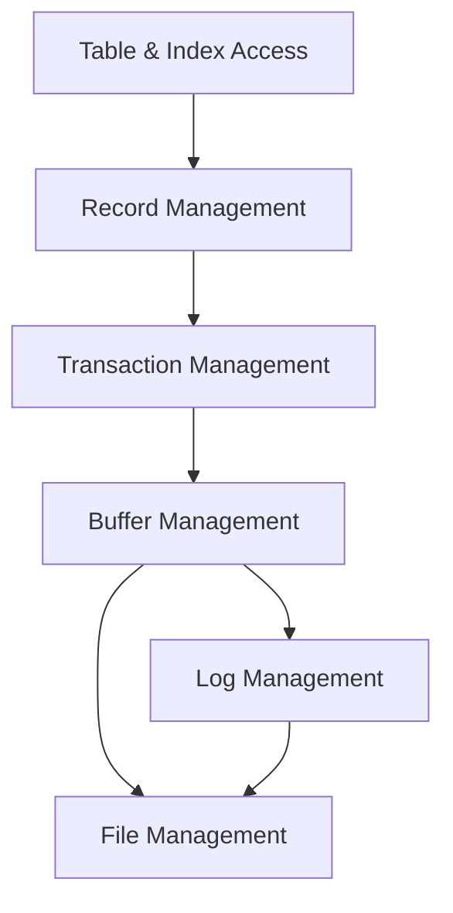

export const name = "PetiteDB";
export const image = "/images/projects/database.png";
export const overview =
  "Lightweight relational DBMS implementing standard layers: file, log, buffer, transaction, record, metadata catalog, and static hash indexes.";
export const topics = ["Java", "DBMS", "ACID", "Relational DB", "Maven"];
export const repoUrl = "https://github.com/MaxFdev/PetiteDB";

{/* TODO finish reviewing: */}

## Overview

PetiteDB is a simplified relational database management system built for COM 3563 (Database Implementation). The stack is Java 17 with Maven; testing uses JUnit Jupiter and logging uses Log4j 2. It implements the usual stack from raw disk blocks up to tables and indexes: file management, write-ahead logging, buffer pooling, transactions (ACID), record layout, a system catalog, and indexing. All data access goes through transactions; the buffer manager caches blocks in memory; and the log layer ensures the database can recover to a consistent state after a crash.

## Layered Architecture

From bottom to top, the layers are:

- **File**: Storage is seen as fixed-size **blocks**. `FileMgr` reads and writes whole blocks; `BlockId` identifies a block in a file; `Page` is an in-memory buffer for block content.
- **Log**: **Write-ahead logging (WAL)**. Before any data change is written to disk, it is appended to a sequential log. On recovery, the log is replayed so the database returns to a consistent state.
- **Buffer**: The **BufferMgr** keeps a pool of in-memory **buffers**, each holding one block. It supports **pinning** (reserving a buffer for a transaction) and **eviction** (choosing a buffer to reuse when the pool is full). Eviction policies include NAIVE and CLOCK.
- **Transaction**: The **Tx** layer provides ACID. It works with a concurrency manager (e.g. locking for isolation) and a recovery manager (using the log for atomicity and durability). Every read/write goes through a transaction.
- **Record**: Raw bytes in a block are interpreted as **records**. A **Schema** defines field names and types; a **Layout** gives byte offsets and slot size so records are packed into fixed-size **slots** in a block.
- **Metadata**: **TableMgr** maintains the **system catalog**—special tables that store names and schemas of all user tables and their fields. The DB uses this to know what tables exist and how they are structured.
- **Index**: **IndexMgr** creates and manages indexes. The implementation supports **static hash indexes** that map search keys to record locations for faster lookups than full table scans.

## Key Concepts

- **WAL and recovery**: All modifications are first written to the log. On restart, the recovery manager uses the log to redo (and optionally undo) changes so the database is consistent and durable.
- **Buffer pinning and eviction**: A transaction pins a buffer while it is using a block; the buffer cannot be evicted until it is unpinned. When the pool is full and a new block is needed, the buffer manager picks an unpinned buffer (e.g. via CLOCK) and writes it back if dirty, then reuses it.
- **Slot layout**: A block is divided into a header (e.g. slot directory) and fixed-size slots. Layout computes the size and offset of each slot so records can be read and written by slot index.
- **System catalog**: Tables like `tblcat` and `fldcat` store table names and field metadata. TableMgr creates and queries these so the engine can open tables by name and know their schema.
- **Static hash index**: An index structure that maps key values to record IDs (block + slot). Queries that filter on the indexed key can use the index instead of scanning the whole table.

## Module Map

| Package                  | Main types             | Role                                  |
| ------------------------ | ---------------------- | ------------------------------------- |
| `edu.yu.dbimpl.file`     | FileMgr, BlockId, Page | Block I/O to files                    |
| `edu.yu.dbimpl.log`      | LogMgr                 | Append and read log records           |
| `edu.yu.dbimpl.buffer`   | BufferMgr, Buffer      | Page pool, pin/unpin, eviction        |
| `edu.yu.dbimpl.tx`       | Tx, TxMgr              | Transactions, concurrency, recovery   |
| `edu.yu.dbimpl.record`   | Schema, Layout         | Record structure and slot layout      |
| `edu.yu.dbimpl.metadata` | TableMgr               | System catalog                        |
| `edu.yu.dbimpl.index`    | IndexMgr, Index        | Index creation and lookup (e.g. hash) |

## Build and Run

- **Java**: 17
- **Maven**: 3.x
- **Dependencies**: JUnit Jupiter (testing), Log4j 2 (logging)

Build and run tests with Maven from the repo root. The `src` tree contains the layered implementation.
