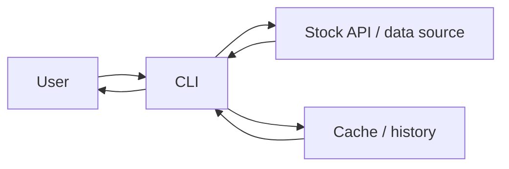

export const name = "StockTerminal";
export const image = "/images/projects/StockTerminal.png";
export const overview =
  "CLI app to retrieve and analyze real-time stock data: query by symbol and flags, live feed, and history (Software Engineering project).";
export const topics = ["Java", "Fintech", "Stock Data", "CLI"];
export const repoUrl = "https://github.com/MaxFdev/StocksTerminal_SE_Project";

## Overview

StockTerminal is a Java command-line application that retrieves and displays stock market data that was built for a software engineering project.
The app calls an external stock/market data API to fetch quotes and uses in-memory caching for recent symbols.
You run the program and use “stock” as the first argument, then you issue commands to query one or more ticker symbols, request specific data fields,
refresh or clear cache, list history, or run a live updating feed for a symbol. It is aimed at quick lookups (e.g. by brokers or developers)
and can be scripted (e.g. bash calling the app and reacting to output).

## Request Flow



- The **user** types commands in the shell.
- The **CLI** parses commands (help, query, clear, refresh, remove, history, Live, quit) and either looks up **cached** data or calls the
**stock API** (or backend) for fresh data.
- Results are formatted and printed. For “query” and “Live,” the data returned depends on the **request flags** you pass.

## Commands

- **help**: Prints available commands and options (e.g. request flags and what they mean).
- **Query**: `[stock_symbol(s)] [request_flags]`  
  Fetches data for the given symbol(s). Symbols and flags are separated by spaces.
- **clear**: Clears the stock history/cache so the next query refetches fresh data.
- **refresh**: Refetches data for the last N stocks (e.g. up to 10) with all offered fields.
- **remove [symbol(s)]**: Removes the listed symbol(s) from cache; if no symbol is given, removes the most recently added.
- **history**: Lists the symbols that have been requested and not removed.
- **Live [symbol]**: Starts a live feed for one symbol: data is updated at a set interval in the CLI.
- **quit**: Exits the program.

## Request Flags

After the symbol(s), you can pass a minus sign followed by one or more letters to choose which fields to return:

- **o** (open): Day’s open price
- **h** (high): Day’s high
- **l** (low): Day’s low
- **e** (price): Current price
- **v** (volume): Volume
- **t** (latest trading day): Last trading day
- **p** (previous close): Previous closing price
- **c** (change): Change since day’s open
- **r** (change percent): Change since open as a percentage

So `-pov` means previous close, open, and volume, while no flags means “all of the above.”

## Use Cases

- **Quick lookups**: Get current price, open, volume, etc., for one or several tickers without leaving the terminal.
- **Scripting**: Call the app from a bash script and parse output (e.g. send an email when a price crosses a threshold).
- **Learning**: See how a CLI can wrap a stock API and format real-time data.

## Run

Run the program (e.g. JAR or from the `stockterminal_se` project). First argument is “stock”, then use the commands above. Example query:

```text
stock aapl amzn -pov
```

This returns previous close, open, and volume for AAPL and AMZN.
