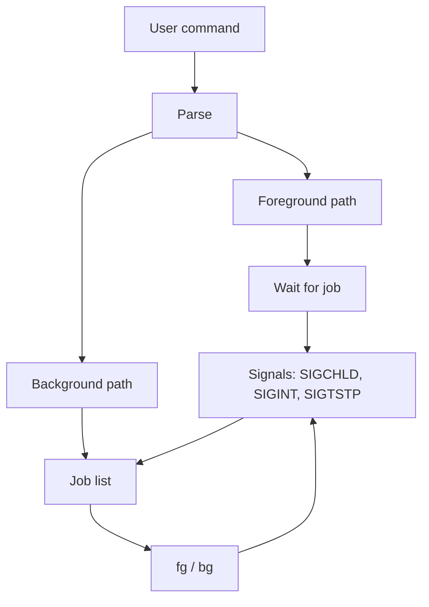

export const name = "Tiny Shell (tsh)";
export const image = "/images/projects/tsh.jpg";
export const overview =
  "C shell project demonstrating signal handling and process management: run commands in foreground or background, with jobs, fg, and bg.";
export const topics = ["C", "Shell", "Unix", "Signals", "Process Management"];
export const repoUrl = "https://github.com/MaxFdev/tsh";

{/* TODO finish reviewing: */}

## Overview

tsh is a minimal Unix shell written in C, built with Make. It uses only standard Unix/POSIX APIs: fork, exec, wait, and signal handling (SIGCHLD, SIGINT, SIGTSTP). It runs external programs (by path or name), supports foreground and background execution, and provides job control: list jobs, bring a job to the foreground, or send it to the background. The project focuses on **signal handling** and **process management** (job list, process groups). It is intended to demonstrate mastery of these OS concepts in a small, well-defined shell.

## Job Control Flow

- **User command**: A line of input (e.g. `ls -l`, `sleep 10 &`).
- **Parse**: The shell parses the command to see if it ends with `&` (background) or not (foreground), and extracts the program path and arguments.
- **Foreground path**: If not backgrounded, the shell runs the program in the foreground: it gives the job the terminal (process group), then waits for it. The user cannot run another command until it finishes or is stopped (Ctrl+Z) or interrupted (Ctrl+C).
- **Background path**: If the command ends with `&`, the shell runs the program in the background. It does not wait; it adds the job to the **job list** and prints its job ID so the user can later use `fg` or `bg`.
- **Job list**: The shell keeps a list of jobs (running or stopped). Each job has a job ID, process ID(s), state (running/stopped), and the command line. `jobs` prints this list.
- **fg / bg**: `fg [job]` brings a job to the foreground (resumes it if stopped, gives it the terminal, waits). `bg [job]` resumes a stopped job in the background. These update the job list and process group / terminal ownership.
- **Signals**: **SIGCHLD** is received when a child exits or stops; the shell updates the job list (reaps zombies, marks jobs as terminated or stopped). **SIGINT** (Ctrl+C) is sent to the foreground job to interrupt it. **SIGTSTP** (Ctrl+Z) stops the foreground job and returns control to the shell so the job appears in `jobs` as stopped.

## Foreground vs Background

- **Foreground**: The shell forks, the child execs the program, and the shell waits (e.g. `waitpid`). The child is in the foreground process group and receives terminal signals (Ctrl+C, Ctrl+Z). Only one foreground job at a time.
- **Background**: The shell forks, the child execs the program, and the shell does _not_ wait. The child is in a background process group; the shell adds it to the job list and immediately prints a new prompt. The user can start more commands or use `fg`/`bg`/`jobs`.

## Signals in Detail

- **SIGCHLD**: When a child exits or is stopped by SIGTSTP, the kernel sends SIGCHLD to the shell. The handler reaps the child (waitpid with WNOHANG or similar) and updates the job list so `jobs` shows correct states and so the shell doesn’t leave zombies.
- **SIGINT**: Typically bound to Ctrl+C. The shell should send it to the foreground job’s process group so the running program is interrupted, not the shell.
- **SIGTSTP**: Typically bound to Ctrl+Z. The shell sends it to the foreground job so the job is stopped; the shell then reports the job as stopped and continues prompting.

## Build and Test

- **Build**: Go to the `shell` directory and run `make`. This produces the `tsh` binary (or similar; see Makefile).
- **Run**: From the repo root (or as specified in the README), run `tsh`.  
  Flags: `-h` (help), `-v` (diagnostics), `-p` (no prompt).
- **Test**: In `shell`, run `./tester.sh` (ensure it’s executable: `chmod +x tester.sh`). Compare or validate `results.txt`; differences that are only in run commands and process IDs (e.g. when `ps` is run) are typically acceptable.
